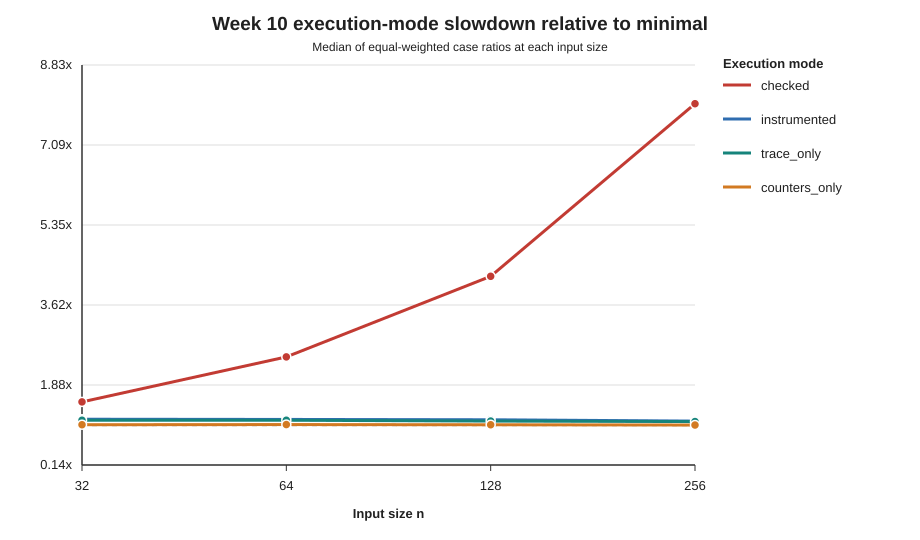
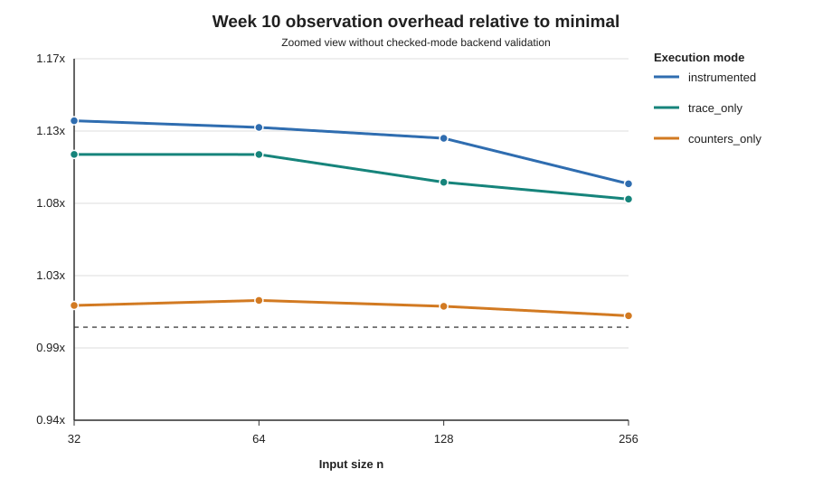

# Week 10 Timing-Contamination Pilot

Last updated: 2026-07-28

Status: Day 6 full pilot completed and validated; final mode selection is
reserved for Day 7.

## Purpose

This pilot measures how much the ordinary-list paper implementation's runtime
changes when complete backend validation, trace recording, and operation
counters are disabled in controlled combinations.

It does not measure a heterogeneous finger-tree implementation and does not
establish linear-time complexity.

## Run Evidence

```text
run_id:
    week10_contamination_full_20260728

source commit:
    c195a2f3c79df3ebd6f2e7205a5c70bcd956362e

source worktree:
    clean

families:
    flat_valid
    nested_valid
    incremental_valid

sizes:
    32, 64, 128, 256

cases:
    20

execution modes:
    checked
    instrumented
    trace_only
    counters_only
    minimal

warm-up runs:
    3

measured runs:
    15
```

The generated run contains:

```text
raw rows:           1,500
case-summary rows:    100
group-summary rows:    60
errors:                 0
incorrect outputs:      0
failed audits:          0
validator valid:     true
```

The raw CSV SHA-256 recorded by the manifest is:

```text
f200988d37d7e9789275ec8af4321fb21bef425ae270024e230ebc67a1b74e41
```

Generated run files remain under
`results/runs/week10_contamination_full_20260728/` and are not committed by
default.

## Aggregation Method

Each execution mode is first summarized by the median of its 15 measured runs
for one case. Slowdown ratios are then calculated within that case using
`minimal` as the baseline.

The tables below report medians and quartiles across equal-weighted cases.
There are 20 cases in total: four flat, four nested, and twelve incremental
cases. Because the frozen experiment deliberately includes three incremental
cases per size, the overall table gives incremental cases more weight. The
family table is therefore also reported separately.

## Component Overhead

| Component | Comparison | Median overhead | Median ratio | Q1-Q3 ratio |
| --- | --- | ---: | ---: | ---: |
| Complete backend validation | checked / instrumented | 0.510 ms | 1.578x | 1.009x-3.779x |
| Trace recording | trace_only / minimal | 0.240 ms | 1.102x | 1.091x-1.114x |
| Operation counters | counters_only / minimal | 0.027 ms | 1.013x | 1.007x-1.018x |
| Trace and counters combined | instrumented / minimal | 0.300 ms | 1.126x | 1.115x-1.135x |

The wide validation IQR shows that complete backend validation does not add a
uniform constant factor. Its effect depends strongly on the case structure
and input size.

## Scaling by Input Size

The values below are median case-level ratios relative to `minimal`.

| n | checked | instrumented | trace_only | counters_only |
| ---: | ---: | ---: | ---: | ---: |
| 32 | 1.510x | 1.133x | 1.111x | 1.014x |
| 64 | 2.488x | 1.129x | 1.111x | 1.017x |
| 128 | 4.239x | 1.122x | 1.093x | 1.013x |
| 256 | 7.989x | 1.092x | 1.083x | 1.007x |



The checked-mode ratio increases sharply with `n`, while the trace and counter
ratios remain comparatively stable. This supports the conclusion that
backend-wide correctness validation can mask the runtime of the ordinary-list
paper control flow at larger tested sizes.

The zoomed figure below removes checked mode so that the smaller observation
costs remain visible.



## Differences by Family

The values below aggregate all four tested sizes within each family.

| Family | checked | instrumented | trace_only | counters_only |
| --- | ---: | ---: | ---: | ---: |
| flat_valid | 1.162x | 1.155x | 1.128x | 1.008x |
| nested_valid | 1.121x | 1.115x | 1.096x | 1.009x |
| incremental_valid | 3.435x | 1.126x | 1.100x | 1.016x |

The large checked slowdown is concentrated in the incremental cases. Because
checked and instrumented differ in complete backend validation policy, this is
consistent with the incremental cases reaching validation-sensitive backend
states more often. The pilot does not record enough per-commit detail to claim
a complete causal explanation, so this remains an implementation-level
interpretation rather than a structural theorem.

## Main Findings

1. Complete backend validation materially contaminates timing for larger and
   incremental cases. At `n=256`, the median checked slowdown is about `7.99x`.
2. Trace recording adds a stable cost of roughly `10%` at the case level.
3. Operation counters add a much smaller median cost of roughly `1.3%`.
4. Enabling trace and counters together adds a median slowdown of about
   `1.126x`; the five-mode design therefore successfully separates most of the
   observation cost.
5. Removing instrumentation changes measured runtime substantially, but
   `minimal` still includes ordinary-list materialization, local safety checks,
   `stage_results`, and output recovery.

## Interpretation Boundary

The permitted conclusion from this pilot is:

> Removing correctness and debug instrumentation substantially changes the
> measured runtime of the ordinary-list implementation, and complete backend
> validation can dominate checked execution for larger tested inputs.

The pilot does not support any of the following claims:

- `minimal` proves linear-time Jordan sorting;
- the ordinary-list backend has the paper's asymptotic data-structure bounds;
- these three generator families represent all valid Jordan sequences;
- one macOS run is sufficient for final cross-environment performance claims.

Final timing-mode selection and the Week 11 experiment gate remain Day 7
decisions.

## Reproduction

```bash
python experiments/run_week10_timing_contamination.py \
  --full \
  --run-id week10_contamination_full_20260728 \
  --run-dir results/runs/week10_contamination_full_20260728

python experiments/validate_week10_timing_outputs.py \
  --run-dir results/runs/week10_contamination_full_20260728

python experiments/analyze_week10_contamination.py \
  --run-dir results/runs/week10_contamination_full_20260728 \
  --case-overheads-csv \
    results/runs/week10_contamination_full_20260728/case_overheads.csv \
  --mode-table-csv docs/analysis/week10_mode_overhead_table.csv \
  --component-table-csv docs/analysis/week10_component_overhead_table.csv \
  --size-ratios-csv docs/analysis/week10_runtime_ratio_by_size.csv \
  --family-ratios-csv docs/analysis/week10_runtime_ratio_by_family.csv \
  --ratio-figure docs/analysis/week10_runtime_ratio_by_size.svg \
  --observation-figure docs/analysis/week10_observation_ratio_by_size.svg
```
