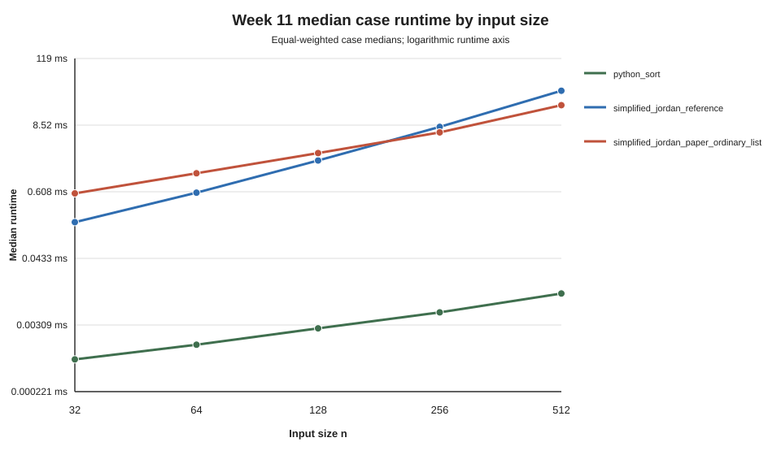
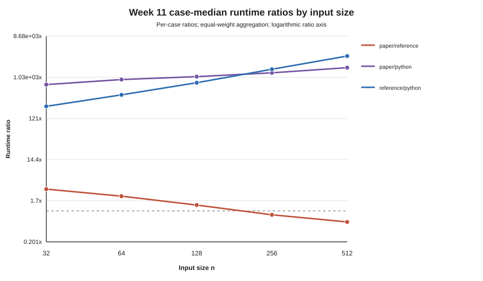

# Week 11 Paper-Sorting Pilot Analysis

Last updated: 2026-08-03

## Evidence and Reproduction

This analysis reads only the archived run:

```text
results/runs/week11_pilot_v1__run003
```

The source run records commit:

```text
01f6480fe179dcbe0f99486be86384b61dd4121f
```

Before reading the CSV evidence, the analysis reruns the independent Week 11
validator and writes its new report outside the archive. The archived run is
never modified.

```bash
python experiments/analyze_week11_pilot.py \
  --run-dir results/runs/week11_pilot_v1__run003 \
  --output-dir docs/analysis
```

The validated input contains:

```text
raw rows:             1,050
case-summary rows:      105
group-summary rows:      45
case-audit rows:          35
raw errors:                0
incorrect outputs:         0
failed audits:              0
validator valid:         true
```

Anonymous benchmark metadata records Apple M4 / arm64, 16 GiB memory, macOS
26.6, and CPython 3.12.4. Formal-entry readiness was `clean`: one- and
five-minute load per logical CPU were `0.219` and `0.202`, both below the
pilot recommendation of `0.25`; load was stable, power and disk checks passed,
and no warning was recorded. CPU temperature was not captured.

## Method

Each case-algorithm cell contains ten measured runs. The primary runtime for a
cell is its median. Size and family summaries then give every generated case
equal weight. Ratios are computed within each exact case before aggregation;
this avoids dividing two independently aggregated distributions.

The relative IQR is:

```text
(Q3 - Q1) / median
```

Rows above `0.25` are flagged as high variability. Spearman coefficients are
descriptive within each fixed size, where only seven cases are available.

## Runtime by Size

Median case runtimes are:

| n | Python sort | Reference | Paper ordinary-list |
| ---: | ---: | ---: | ---: |
| 32 | 0.0008 ms | 0.182 ms | 0.570 ms |
| 64 | 0.0014 ms | 0.586 ms | 1.264 ms |
| 128 | 0.0027 ms | 2.098 ms | 2.813 ms |
| 256 | 0.0051 ms | 7.949 ms | 6.386 ms |
| 512 | 0.0108 ms | 33.271 ms | 18.769 ms |



Python's built-in sort is much faster than both research implementations. The
paper implementation is slower than the reference pipeline at the first three
sizes, but faster at `n=256` and `n=512` in this pilot.

## Runtime Ratios

The median paper/reference ratio by size is:

| n | Paper / reference |
| ---: | ---: |
| 32 | 3.096x |
| 64 | 2.148x |
| 128 | 1.354x |
| 256 | 0.818x |
| 512 | 0.564x |

Across all 35 exact cases, the median ratios are:

```text
paper / reference:  1.354x
paper / Python:  1,076.458x
reference / Python: 779.317x
```

Timing-scope boundary: `simplified_jordan_reference` is timed as its complete
reference pipeline, including oracle validation, family-tree construction,
structural profiling, and reference-output work. The paper implementation is
timed only as the pre-certified `minimal` sorting call; oracle certification
and the checked diagnostic are outside its timed region. Paper/reference
ratios are therefore pipeline-scope comparisons, not like-for-like end-to-end
speedups or evidence of superior asymptotic complexity.



The logarithmic axis is necessary because ratios involving Python sort are
orders of magnitude larger than paper/reference ratios.

## Family Effects

Paper/reference ratios by family and size are:

| Family | n=32 | n=64 | n=128 | n=256 | n=512 |
| --- | ---: | ---: | ---: | ---: | ---: |
| flat | 2.556x | 1.616x | 0.920x | 0.513x | 0.280x |
| nested | 2.583x | 1.728x | 1.116x | 0.738x | 0.520x |
| incremental | 3.115x | 2.213x | 1.362x | 0.840x | 0.567x |

The crossover is visible in every family, although at different sizes. Flat
and nested have one deterministic case per size, while incremental has five
seeded cases. Overall size medians therefore mostly describe incremental
cases; family-specific tables must accompany them.

## Variability and Anomalies

Median and maximum relative IQR by algorithm are:

| Algorithm | Median relative IQR | Maximum | Rows above 0.25 |
| --- | ---: | ---: | ---: |
| Python sort | 0.070 | 0.323 | 5 |
| Reference | 0.012 | 0.046 | 0 |
| Paper ordinary-list | 0.016 | 0.035 | 0 |

All five high-variability cells belong to Python sort. Its calls are measured
in microseconds or less, so timer granularity and normal system activity form
a large fraction of the observed value. No reference or paper cell crosses the
chosen threshold.

The five flagged Python cells are one nested `n=64` case, one incremental
`n=128` case, one nested `n=256` case, and one flat plus one incremental
`n=512` case. They remain in the evidence; no outlier was removed.

The captured measured calls sum to:

```text
Python sort:          0.001338881 s
Reference:            3.045208795 s
Paper ordinary-list:  1.940839928 s
All measured calls:   4.987387604 s
```

This is not the pilot wall-clock duration. The archive does not contain a
full-run elapsed timer covering generation, diagnostics, warm-up, validation,
and file writing, so total wall-clock time is reported as unavailable.

## Structure and Counters

Within-size structure correlations use only seven mixed-family observations.
The reference runtime has consistently positive descriptive associations with
nesting and containment measures. The paper runtime associations are smaller
and vary by size. These values are useful for selecting follow-up tables, but
they do not support causal or asymptotic claims.

The checked paper diagnostic counters for sibling scans, list splits, copied
items, and transferred items generally have positive within-size associations
with minimal-mode runtime. `paper_invariant_checks` is constant within each
size, so its Spearman coefficient is undefined. The counters come from an
untimed checked diagnostic, whereas runtime comes from minimal mode; this
separation avoids timing contamination but limits the result to a descriptive
relationship between the same input's diagnostic structure and runtime.

## Week 12 Decision

The pilot is technically stable enough to freeze a larger valid-input sorting
experiment:

```text
protocol:                 week12_formal_sorting_v1
sizes:                    32, 64, 128, 256, 512
flat cases per size:      1
nested cases per size:    1
incremental cases/size:  10
algorithms:               the same three algorithms
warm-up runs:             5
measured runs:           20
paper timing mode:        minimal
paper audit mode:         checked
expected raw rows:        3,600
status:                   frozen_not_executed
```

Flat and nested remain single deterministic cases because repeated seeds do
not create new sequences for those generators. The randomized incremental
sample is enlarged. The gate binds the exact run003 manifest by SHA-256.
Results must still be reported by family and size rather than pooled into one
headline runtime.

## Limitations and Non-Claims

This pilot does not establish:

- linear-time Jordan sorting;
- asymptotic complexity from five input sizes;
- performance of level-linked trees or heterogeneous finger trees;
- recognition performance on invalid input;
- generality beyond the three tested valid families;
- cross-machine absolute timing reproducibility;
- a thermal conclusion, because CPU temperature was not recorded;
- statistical independence for the deterministic flat and nested rows.

The paper implementation uses an ordinary-list backend and oracle-certified
valid input. It performs actual paper-facing Step 1/2/3 sorting, but its backend
is deliberately not the theoretical linear-time data structure.
