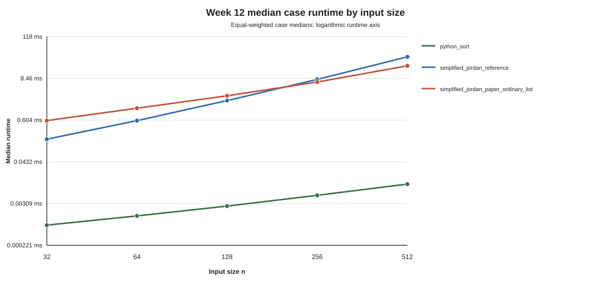
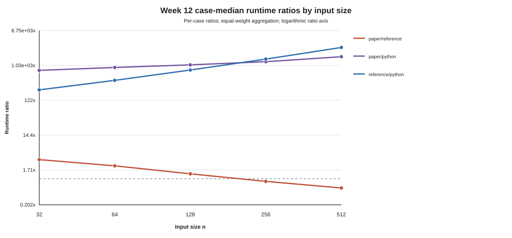

# Results Draft

Last updated: 2026-08-06

Status: Week 13 Results chapter draft; awaiting review.

## Evidence Status and Correctness

The Results chapter uses only the immutable Week 12 execution
`week12_formal_sorting_v1__run001` and analysis artifacts regenerated from that
archive. Live validation accepted the archive with no errors and confirmed
3,600 raw rows, 180 case summaries, 45 group summaries, and 60 checked case
audits. [R-01]

Across the archived evidence, all 3,600 measured rows are oracle-certified,
have correct sorted output, carry a passed audit, and contain no recorded
error. All 180 case summaries report correct, error-free cells, and all 60
checked audits pass. This is empirical correctness for the frozen cases; it is
not a proof for every valid Jordan sequence. [R-01]

Source: [`week12_correctness_audit_totals.csv`](../analysis/week12_correctness_audit_totals.csv)
and [`week12_live_validation_report.json`](../analysis/week12_live_validation_report.json).

## Runtime by Input Size

All absolute times in this section belong to one recorded execution on Apple
M4/arm64 with 16 GB memory, macOS 26.6, and CPython 3.12.4. The reference value
times the complete oracle-backed reference pipeline. The paper value times only
the pre-certified ordinary-list core in `minimal` mode; its oracle certification
and checked diagnostic are outside timing. The Python value times its own list
construction inside the algorithm call. [R-04, M-06, M-07, M-13]

The median exact-case runtimes were: [R-04]

| n | Cases | Python sort (ms) | Reference pipeline (ms) | Paper ordinary-list (ms) |
| ---: | ---: | ---: | ---: | ---: |
| 32 | 12 | 0.000791 | 0.181177 | 0.586906 |
| 64 | 12 | 0.001417 | 0.585667 | 1.282198 |
| 128 | 12 | 0.002635 | 2.077959 | 2.815083 |
| 256 | 12 | 0.005208 | 7.929646 | 6.721250 |
| 512 | 12 | 0.010584 | 33.014458 | 18.716687 |

Source: [`week12_runtime_by_size.csv`](../analysis/week12_runtime_by_size.csv).

At every tested size, Python sort has the smallest median call time. Under the
frozen pipeline scopes, the paper call is larger than the reference call at
`n=32`, `64`, and `128`, and smaller at `n=256` and `512`. This statement is a
comparison of the timed calls shown above, not an end-to-end or asymptotic
performance claim. [R-03, R-04]

## Matched-Case Runtime Ratios

The primary comparison is the paper/reference ratio computed within each exact
case and then aggregated across the twelve cases at a size. A ratio above one
means that the pre-certified paper call has the larger median time; a ratio
below one means it has the smaller median time. Because the reference and paper
timed scopes differ, these values are pipeline-scope ratios rather than
like-for-like end-to-end speedups. [R-02, R-03, L-03]

| n | Cases | Median paper/reference ratio |
| ---: | ---: | ---: |
| 32 | 12 | 3.226420 |
| 64 | 12 | 2.202394 |
| 128 | 12 | 1.351064 |
| 256 | 12 | 0.850597 |
| 512 | 12 | 0.567187 |

Source: [`week12_runtime_ratios.csv`](../analysis/week12_runtime_ratios.csv),
`scope=size` and `comparison=paper/reference`.

The median exact-case ratio declines across all five tested sizes, from
`3.226` at `n=32` to `0.567` at `n=512`. It remains above one through `n=128`
and is below one at `n=256` and `n=512`. Thus the observed crossover lies
between the tested sizes `128` and `256`. The five points describe the frozen
sample and do not establish an asymptotic rate. [R-02, R-03, L-02]

Across all sixty exact cases, the overall median ratios are: [R-05]

| Comparison | Cases | Median ratio |
| --- | ---: | ---: |
| Paper/reference | 60 | 1.351064 |
| Paper/Python | 60 | 1,117.902852 |
| Reference/Python | 60 | 784.015810 |

The two research implementations are therefore orders of magnitude above the
Python baseline in the overall exact-case ratios. These pooled-over-size
medians summarize the tested cases and are not asymptotic growth estimates.
[R-05, L-02]

## Family-Specific Ratios

The paper/reference ratio also decreases with size within each of the three
controlled families: [R-06]

| Family | Cases per size | n=32 | n=64 | n=128 | n=256 | n=512 |
| --- | ---: | ---: | ---: | ---: | ---: | ---: |
| Flat | 1 | 2.550795 | 1.609025 | 0.919051 | 0.509697 | 0.281381 |
| Nested | 1 | 2.563670 | 1.748004 | 1.099397 | 0.726798 | 0.525490 |
| Incremental | 10 | 3.281790 | 2.217258 | 1.358474 | 0.859922 | 0.569733 |

Source: [`week12_runtime_ratios.csv`](../analysis/week12_runtime_ratios.csv),
`scope=family_size` and `comparison=paper/reference`.

The flat case first falls below one at `n=128`; the nested and incremental
families first fall below one at `n=256`. These crossing statements apply only
to the listed constructions and sizes. Flat and nested each contribute one
deterministic case per size, whereas incremental contributes ten seeded cases.
[R-06, R-07]

The overall size medians are consequently not balanced family averages. Ten of
the twelve cases at each size are incremental, so the incremental rows have the
largest influence on the size-level median. The family table is retained to
make that composition visible. [R-06, R-07, L-08]

## Runtime Variability

Relative IQR is `IQR / median` for one exact case-algorithm cell. The analysis
flagged cells at or above `0.25` for inspection without removing them. [R-08]

| Algorithm | Median relative IQR | Maximum relative IQR | Cells at or above 0.25 |
| --- | ---: | ---: | ---: |
| Python sort | 0.0556 | 0.2520 | 1 |
| Reference pipeline | 0.0119 | 0.0661 | 0 |
| Paper ordinary-list | 0.0152 | 0.0242 | 0 |

The only flagged cell is `incremental_valid_n512_001` under Python sort, with
relative IQR `0.251996`. It remains in every aggregation. No reference or paper
cell reaches the inspection threshold. The threshold is a study-specific flag,
not a universal outlier definition, and the table does not assign a cause to
the observed variation. [R-08]

Source: [`week12_case_runtime_metrics.csv`](../analysis/week12_case_runtime_metrics.csv)
and [`week12_analysis_summary.json`](../analysis/week12_analysis_summary.json).

## Measured Calls and Pipeline Wall-Clock

The captured measured calls sum to: [R-09]

| Algorithm | Measured calls | Total measured-call time (s) |
| --- | ---: | ---: |
| Python sort | 1,200 | 0.004750632 |
| Reference pipeline | 1,200 | 10.445239255 |
| Paper ordinary-list | 1,200 | 6.919634017 |
| All algorithms | 3,600 | 17.369623904 |

Source: [`week12_measured_elapsed.csv`](../analysis/week12_measured_elapsed.csv).

These sums contain only measured algorithm calls. They exclude warm-ups,
generation, certification, diagnostics, summaries, and file operations and
must not be interpreted as complete experiment duration. [R-09]

The recorded formal pipeline wall-clock is `837.682385541 s`. Its scope begins
at formal evidence-directory reservation and covers config/environment writes,
case generation, oracle certification, checked diagnostics, warm-ups, measured
calls, summary construction, and CSV writes. Manifest writing and validation
are excluded. This is a pipeline duration, not algorithm runtime, and it is not
allocated among the three algorithms. [R-10]

Source: [`run001/manifest.json`](../../results/runs/week12_formal_sorting_v1__run001/manifest.json),
`experiment_elapsed_ns` and `experiment_elapsed_scope`.

## Week 11 Directional Replication

Week 11 and Week 12 are compared only through ratios formed within each run.
Their absolute runtimes are not pooled. The paper/reference size medians are:
[R-11, L-06]

| n | Week 11 paper/reference | Week 12 paper/reference |
| ---: | ---: | ---: |
| 32 | 3.095548 | 3.226420 |
| 64 | 2.148361 | 2.202394 |
| 128 | 1.354239 | 1.351064 |
| 256 | 0.817629 | 0.850597 |
| 512 | 0.564000 | 0.567187 |

For paper/reference, paper/Python, and reference/Python, the size-rank Spearman
coefficient between Week 11 and Week 12 is `1.0`. Each comparison has matching
direction on all four adjacent-size transitions and remains on the same side of
ratio one at all five sizes. [R-11]

Source: [`week12_week11_ratio_trends.csv`](../analysis/week12_week11_ratio_trends.csv)
and [`week12_week11_trend_summary.csv`](../analysis/week12_week11_trend_summary.csv).

This supports directional replication of the pilot pattern under the larger
Week 12 protocol. It does not show equality between runs, provide a pooled
estimate, or establish hardware-independent absolute time. [R-11, L-06]

## Exploratory Structure Relationships

The following Spearman coefficients use only the twelve mixed-family cases at
each fixed size. They are descriptive and exploratory; the unbalanced family
composition and small within-size sample preclude causal or asymptotic
interpretation. [E-01, E-02, L-07, L-08]

| n | Reference/depth | Reference/containment density | Paper/depth | Paper/containment density |
| ---: | ---: | ---: | ---: | ---: |
| 32 | 0.814 | 0.895 | -0.246 | -0.238 |
| 64 | 0.885 | 0.944 | 0.011 | 0.112 |
| 128 | 0.856 | 0.944 | 0.414 | 0.469 |
| 256 | 0.897 | 0.979 | 0.448 | 0.559 |
| 512 | 0.932 | 0.951 | 0.340 | 0.462 |

Source: [`week12_structure_runtime_relationships.csv`](../analysis/week12_structure_runtime_relationships.csv).

Reference runtime has a positive descriptive association with both maximum
depth and containment-pair density at every size. The corresponding paper
coefficients are smaller and vary in sign or magnitude across sizes. This does
not show that the paper runtime is independent of structure; it records only
the observed coefficients in this generated sample. [E-01, E-02]

## Exploratory Checked-Counter Relationships

Checked diagnostic counters and paper runtime come from different policies:
the counters are collected by an untimed `checked` diagnostic, while runtime
uses the `minimal` paper call. Their within-size Spearman coefficients are:
[E-03]

| n | Sibling scans | List splits | Items copied | Items transferred |
| ---: | ---: | ---: | ---: | ---: |
| 32 | 0.919 | 0.965 | 0.919 | 0.919 |
| 64 | 0.646 | 0.842 | 0.646 | 0.598 |
| 128 | 0.418 | 0.429 | 0.418 | 0.260 |
| 256 | 0.326 | 0.319 | 0.326 | 0.249 |
| 512 | 0.417 | 0.253 | 0.417 | 0.285 |

Source: [`week12_paper_counter_runtime_relationships.csv`](../analysis/week12_paper_counter_runtime_relationships.csv).

All four selected counters have positive descriptive associations with minimal
paper runtime at every tested size, although the coefficient magnitudes differ
by size and counter. The relationship is not a causal cost decomposition: the
checked diagnostic work is observed outside the timed minimal call. [E-03,
L-07]

`paper_invariant_checks` is constant across the twelve cases within each size:
30, 62, 126, 254, and 510 checks from `n=32` through `512`. Its within-size
Spearman coefficient is therefore undefined and remains empty in the artifact;
it must not be interpreted as zero association. [E-04]

## Results Boundary

The formal evidence supports empirical correctness on the sixty frozen cases,
the reported runtime distributions and matched-case ratios, and directional
replication of the three within-run ratio series. It also supports the labeled
exploratory coefficients above. It does not establish linear-time Jordan
sorting, asymptotic complexity from five sizes, recognition performance,
causal structural effects, representative sampling of all Jordan sequences, or
a like-for-like end-to-end paper/reference speedup. [R-01, R-02, R-11, L-01,
L-02, L-03, L-05, L-07, L-08]

## Claim Coverage

This chapter covers primary result claims `R-01` through `R-11` and separates
exploratory claims `E-01` through `E-04` into labeled subsections. The full
project limitations remain reserved for the Limitations chapter.
